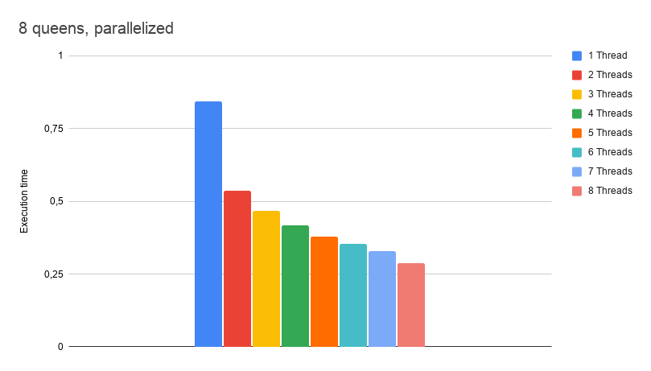
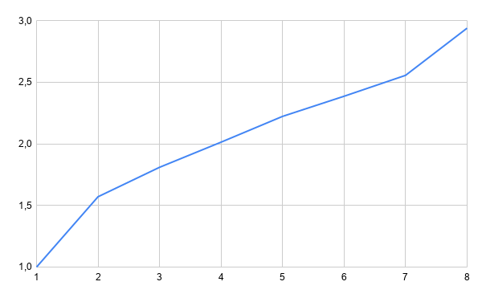

# The 8-queens problem
The 8-queens problem is concerned with placing 8 queens on a chess board in such a way that no one queen can attack another. One can attack another if both are in the same row or column or are on the same diagonal.
Develop a parallel  program (in C/C++ usingOpenMP) to generate all 92 solutions to the 8-queens problem. [Hint: You can use tasks so that the master thread recursively generates queen placements and other tasks to check whether  placements are acceptable.]

Run the program on different number of processors and report the speedup (sequential execution time divided by parallel execution time) for different number of processors (up to at least 4). Run each program several (at least 5) times and use the median value for execution time. Try to provide reasonable explanations to your  results. Measure only the parallel part of your program. Specify the number of processors used by specifying different number of threads (set the OMP_NUM_THREADS environment variable or use a call to omp_set_num_threads(), see the OpenMP specification). To measure the execution time, use  the omp_get_wtime function.

## Implementation
The implementation in *queens.cpp* uses a recursive function *find_solution* to recursively generate different combinations of queens which are then checked for collisions in the *check_solution* function.

The *parallel_solve* function makes *n* number of calls to *find_solution* with the position of the first queen set, each one of these calls is inside a OpenMP task which means that at max *n* number of threads can generate and check solutions at a time.

## How to use
compile the code with:

    make
or compile with optimizations enabled:

    make optimized
The code can then be run with:

    ./queens a b c d
where *a*,*b* and *c* are required parameters but *d* is optional.

- *a* [1 - 8] decides how many threads to use during execution.
- *b* [1 - inf] decides *n* or how big the chess board should be (*n* * *n*) and how many queens to place.
- *c* [1 - inf] decides how many iterations of the problem to run, the printed execution time is the average of these iterations.
- *d* [1 - 2] is an option to run either *print* or *data* mode. *print* mode prints each found solution when it is found, this is usefull to check the validity of the solutions. *data* mode removes all print information except the execution time, this is useful to gather data from the different executions.

## Performance 

The diagram displayes the difference in execution time when running different thread counts and *n = 8*. 

Data from different runs can be found in *data_* where each file *data_x* contains execution times from running with *x* threads and each row *n* in said file contains execution times from running with *n = n* board size.

The gathered data is the average of 10 executions.

The chart above displays the speedup of using *n* threads.